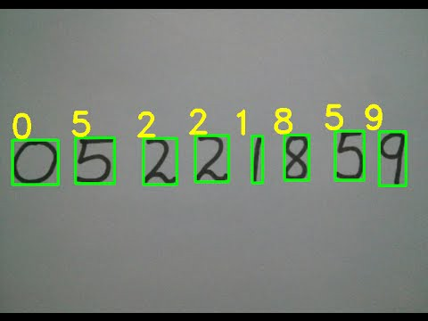

# Optidash_Project_OCR

## What is an OCR ? 
Optical character recognition or optical character reader is the electronic or mechanical conversion of images of typed, handwritten or printed text into machine-encoded text, whether from a scanned document, a photo of a document, a scene-photo or from subtitle text superimposed on an image.




To train our network to recognize these sets of characters, we utilized the MNIST digits dataset as well as the NIST Special Database 19 (for the A-Z characters).

### Installation
First, clone or download this GitHub repository. Install requirements and download pretrained weights:

```
pip install -r ./requirements.txt

# yolov3
wget -P model_data https://pjreddie.com/media/files/yolov3.weights

# yolov3-tiny
wget -P model_data https://pjreddie.com/media/files/yolov3-tiny.weights

# yolov4
wget -P model_data https://github.com/AlexeyAB/darknet/releases/download/darknet_yolo_v3_optimal/yolov4.weights

# yolov4-tiny
wget -P model_data https://github.com/AlexeyAB/darknet/releases/download/darknet_yolo_v4_pre/yolov4-tiny.weights
```
## Quick training for custom mnist dataset
mnist folder contains mnist images, create training data:
```
python mnist/make_data.py
```
`./yolov3/configs.py` file is already configured for mnist training.

Now, you can train it and then evaluate your model
```
python train.py
tensorboard --logdir=log
```
Track training progress in Tensorboard and go to http://localhost:6006/:

<p>
    </a>
</p>

